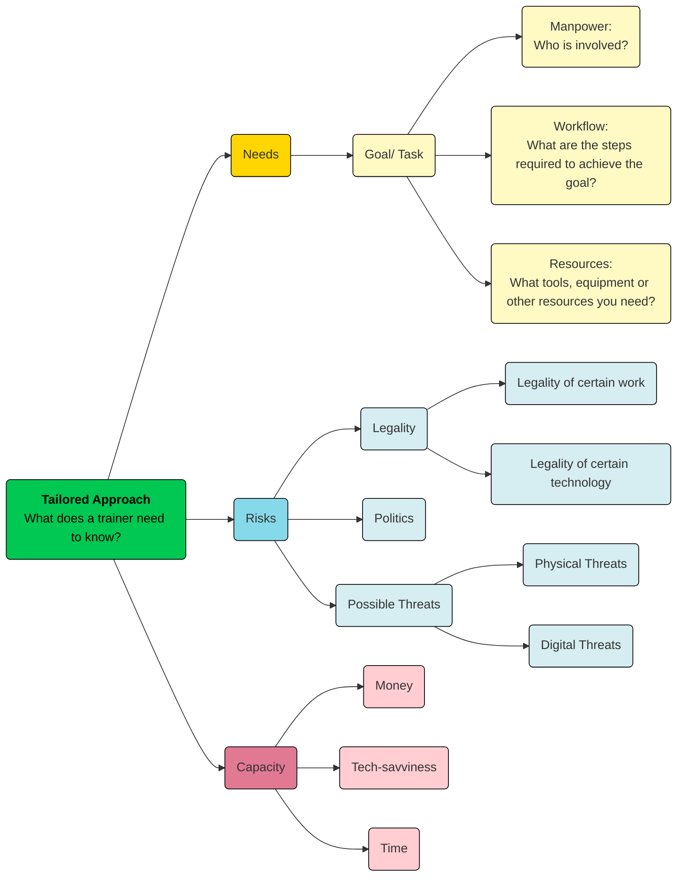

NOTE: this site is just a container for me to show this project to my trusted circle of friends, I don't code, so things might be broken, just focus on the idea and content. ;) 

## Preface

When it comes to digital security training, we recognize that there is no one-size-fits-all solution, which is why we always talk about threat modeling. However, when it comes to shutdown mitigation and contingency planning, this approach is often missing — the digital rights community is always having tool-oriented discussions focusing on promoting certain tools that claim to serve specific purposes at a given time. For example, mesh networks for local communication or VPNs for bypassing throttling or social media shutdowns.

**Mitigation planning should be tailored and factor in different elements.**

### Need and Context-based Tailored Approach

The perspectives of **cost, needs, and risk** specific to each community have yet to be fully considered. The approach to circumventing internet shutdowns should focus on integrating risk, cost, needs, and capability to enhance the feasibility of mitigation plans.

!!! circle-info "Risk"

    Each country has its own political and cultural context, leading to unique challenges and risks, such as the legality of certain technologies.

    Even within the same country, different groups face varying levels of risk. For example, while VPNs can help citizens regain internet access, they are illegal in some places. Similarly, journalists covering protests may face a high risk of police searches, whereas civil society members are more likely to be targeted by cyberattacks.

    It’s essential to factor in risk when developing strategies and to ensure trainees understand the potential consequences of using specific tools or approaches.

!!! circle-info "Needs"

    Communities should prioritize mitigation strategies based on their specific needs. There is no one-size-fits-all solution when providing training—each group requires a tailored approach.

    For example:
    - Journalists need tools for capturing, storing, and securely transmitting footage or information, ensuring they can publish safely once they regain internet access.

    - Activists, on the other hand, may need solutions for real-time, short-distance communication during protests or contingency plans for organizing events without relying on online platforms.

    Understanding these differences helps in designing more effective and relevant training programs.

!!! circle-info "Capacity"

    While efficiency is important, capacity and constraints must always be taken into account when designing strategies, selecting tools, and providing training.

    E.g. In some developing regions, widespread internet access only began recently, meaning many users are not as tech-savvy as expected.

    Setting up digital infrastructure may be too time-consuming for individuals already working long hours or managing family responsibilities.

    Even if a tool or workaround exists, if an organization or individual cannot implement or maintain it, they should consider alternative solutions that better fit their resources and skills.

### Holistic Contingency Planning
A trainer will work to collect the following types of information to assess the most suitable contingency plan for an organization.

#### Hold "Alt" / "Option" and scroll to Zoom In/ Out

