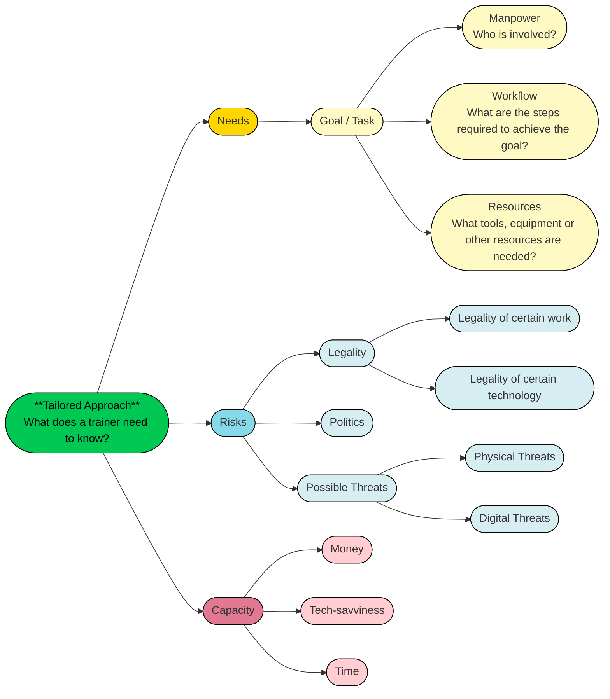

# Building Readiness and Circumvention in Emergencies

## Current Problems 

When it comes to digital security training, we understand that there’s no one-size-fits-all solution, which is why we always emphasize the importance of threat modeling. However, this approach is often overlooked in shutdown mitigation and contingency planning. Many in the community tend to develop guides that focus primarily on tools.

Additionally, a lot of shutdown circumvention guides see "gaining Internet access" as the main goal, mainly promoting specific tools. For example, they might suggest using mesh networks for local communication or VPNs to bypass throttling or social media shutdowns.

In reality, especially during a full blackout, "gaining Internet access" can be nearly impossible or just too costly. For many organizations, what they really need might not be spending a fortune or dedicating half their working hours to regain Internet access. Instead, they might benefit more from secure ways to store their footage for later distribution. Plus, while some guides recommend certain VPNs, using them in specific countries can be illegal and could lead to serious consequences for the organization.

Therefore, the BRACE Framework suggests a needs and context-based tailored approach to Internet shutdown circumvention.

## Need and Context-based Tailored Approach

The perspectives of **cost, needs, and risk** specific to each community have yet to be fully considered. The approach to circumventing Internet shutdowns should focus on integrating risk, cost, needs, and capability to enhance the feasibility of mitigation plans.

!!! circle-info "Risk"

    Each country has its own political and cultural context, leading to unique challenges and risks, such as the legality of certain technologies.

    Even within the same country, different groups face varying levels of risk. For example, while VPNs can help citizens regain Internet access, they are illegal in some places. Similarly, journalists covering protests may face a high risk of police searches, whereas civil society members are more likely to be targeted by cyberattacks.

    It’s essential to factor in risk when developing strategies and to ensure trainees understand the potential consequences of using specific tools or approaches.

!!! circle-info "Needs"

    Communities should prioritize mitigation strategies based on their specific needs. There is no one-size-fits-all solution when providing training—each group requires a tailored approach.

    For example:
    - Journalists need tools for capturing, storing, and securely transmitting footage or information, ensuring they can publish safely once they regain Internet access.

    - Activists, on the other hand, may need solutions for real-time, short-distance communication during protests or contingency plans for organizing events without relying on online platforms.

    Understanding these differences helps in designing more effective and relevant training programs.

!!! circle-info "Capacity"

    While efficiency is important, capacity and constraints must always be taken into account when designing strategies, selecting tools, and providing training.

    E.g. In some developing regions, widespread Internet access only began recently, meaning many users are not as tech-savvy as expected.

    Setting up digital infrastructure may be too time-consuming for individuals already working long hours or managing family responsibilities.

    Even if a tool or workaround exists, if an organization or individual cannot implement or maintain it, they should consider alternative solutions that better fit their resources and skills.

## Holistic Contingency Planning
A trainer will work to collect the following types of information to assess the most suitable contingency plan for an organization.

#### Hold "Alt" / "Option" and scroll to Zoom In/ Out
